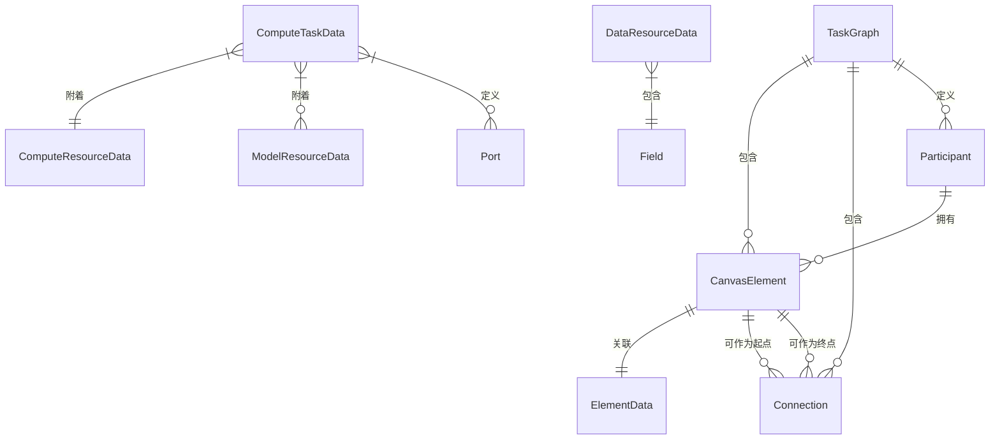

# Data Model: 隐私计算任务可视化拖拽编辑器

**Feature**: 001-privacy-computation-dag-editor
**Date**: 2026-01-16
**Phase**: Phase 1 - Design & Contracts

## 概述

本文档定义隐私计算DAG编辑器的完整数据模型，包括核心实体、关系和验证规则。数据模型基于功能规格的Key Entities，扩展了现有`src/types/dag.ts`的类型定义。

## 核心实体

### 1. 任务图（TaskGraph）

代表一个完整的隐私计算DAG任务图，包含多个元素和连线关系。

```typescript
/**
 * 任务图 - 完整的DAG图定义
 */
export interface TaskGraph {
  /** 唯一标识符 */
  id: string;
  /** 任务图名称 */
  name: string;
  /** 版本号，用于追踪变更 */
  version: string;
  /** 创建时间 */
  createdAt: string;
  /** 最后修改时间 */
  updatedAt: string;
  /** 画布中的所有元素 */
  elements: CanvasElement[];
  /** 元素之间的连线 */
  connections: Connection[];
  /** 参与该隐私计算的参与方 */
  participants: Participant[];
  /** 画布视口状态（缩放、平移） */
  viewport: ViewportState;
}

/**
 * 画布视口状态
 */
export interface ViewportState {
  /** x轴平移量 */
  x: number;
  /** y轴平移量 */
  y: number;
  /** 缩放比例 */
  zoom: number;
}
```

### 2. 画布元素（CanvasElement）

可以是数据资源、计算任务、模型资源或算力资源的统一接口。

```typescript
/**
 * 元素类型枚举
 */
export enum ElementType {
  /** 数据资源 - 圆形 */
  DATA = 'data',
  /** 计算任务 - 圆角长方形 */
  COMPUTE = 'compute',
  /** 模型资源 - 圆角正方形 */
  MODEL = 'model',
  /** 算力资源 - 附着点 */
  COMPUTE_RESOURCE = 'compute-resource',
}

/**
 * 画布元素 - 统一接口
 */
export interface CanvasElement {
  /** 唯一标识符 */
  id: string;
  /** 元素类型 */
  type: ElementType;
  /** 画布中的位置 */
  position: Position;
  /** 元素显示标签 */
  label: string;
  /** 元素关联的参与方ID */
  participantId: string;
  /** 元素数据（根据类型包含不同属性） */
  data: ElementData;
  /** 元素尺寸（由类型决定） */
  size: ElementSize;
  /** 元素状态（选中、禁用等） */
  state: ElementState;
}

/**
 * 位置坐标
 */
export interface Position {
  x: number;
  y: number;
}

/**
 * 元素数据 - 根据类型区分
 */
export type ElementData =
  | DataResourceData
  | ComputeTaskData
  | ModelResourceData
  | ComputeResourceData;

/**
 * 元素尺寸
 */
export interface ElementSize {
  width: number;
  height: number;
}

/**
 * 元素状态
 */
export interface ElementState {
  /** 是否被选中 */
  selected: boolean;
  /** 是否被禁用（不可编辑） */
  disabled: boolean;
  /** 是否显示连接点 */
  showConnectionPoints: boolean;
}
```

### 3. 数据资源（DataResource）

代表数据库表或文件，包含名称、来源方、字段定义、主键、规模等元信息。

```typescript
/**
 * 数据资源数据
 */
export interface DataResourceData {
  /** 资源名称 */
  name: string;
  /** 来源参与方 */
  source: string;
  /** 数据库表名或文件路径 */
  tableName: string;
  /** 字段定义 */
  fields: Field[];
  /** 主键字段名 */
  primaryKey: string;
  /** 数据规模（行数） */
  rowCount: number;
  /** 数据类型（表/文件） */
  dataType: 'table' | 'file';
  /** 描述信息 */
  description?: string;
}

/**
 * 字段定义
 */
export interface Field {
  /** 字段名 */
  name: string;
  /** 数据类型 */
  type: FieldType;
  /** 是否可为空 */
  nullable: boolean;
  /** 是否是主键 */
  isPrimaryKey?: boolean;
  /** 字段描述 */
  description?: string;
}

/**
 * 数据类型枚举
 */
export enum FieldType {
  STRING = 'string',
  NUMBER = 'number',
  BOOLEAN = 'boolean',
  DATE = 'date',
  DATETIME = 'datetime',
  ARRAY = 'array',
  OBJECT = 'object',
}
```

### 4. 计算任务（ComputeTask）

代表隐私计算或本地计算操作，可以有多个输入输出连接，可附着模型和算力。

```typescript
/**
 * 计算任务类型
 */
export enum ComputeTaskType {
  /** 隐私集合求交 */
  PSI = 'PSI',
  /** 安全多方计算 */
  MPC = 'MPC',
  /** 私有信息检索 */
  PIR = 'PIR',
  /** 联邦学习 */
  FL = 'FL',
  /** 数据导入 */
  DATA_IMPORT = 'data-import',
  /** 数据导出 */
  DATA_EXPORT = 'data-export',
  /** 数据过滤 */
  DATA_FILTER = 'data-filter',
  /** 数据拼接 */
  DATA_JOIN = 'data-join',
}

/**
 * 计算任务数据
 */
export interface ComputeTaskData {
  /** 任务名称 */
  name: string;
  /** 任务类型 */
  taskType: ComputeTaskType;
  /** 任务配置参数 */
  config: TaskConfig;
  /** 附着的模型资源ID列表 */
  attachedModels: string[];
  /** 附着的算力资源ID */
  attachedComputeResource?: string;
  /** 输入连接点（上边缘） */
  inputPorts: Port[];
  /** 输出连接点（下边缘） */
  outputPorts: Port[];
  /** 任务描述 */
  description?: string;
}

/**
 * 任务配置 - 根据任务类型不同而不同
 */
export interface TaskConfig {
  /** PSI配置 */
  psiConfig?: PSIConfig;
  /** MPC配置 */
  mpcConfig?: MPCConfig;
  /** FL配置 */
  flConfig?: FLConfig;
  /** 通用配置 */
  genericConfig?: Record<string, any>;
}

/**
 * PSI配置
 */
export interface PSIConfig {
  /** PSI算法类型（rsa/ot/ecc） */
  algorithm: string;
  /** 数据脱敏方式 */
  anonymization?: string;
}

/**
 * MPC配置
 */
export interface MPCConfig {
  /** MPC协议类型 */
  protocol: string;
  /** 安全参数 */
  securityLevel?: number;
}

/**
 * FL配置
 */
export interface FLConfig {
  /** 联邦学习框架 */
  framework: string;
  /** 模型类型 */
  modelType: string;
  /** 轮次 */
  rounds?: number;
}

/**
 * 连接端口
 */
export interface Port {
  /** 端口ID */
  id: string;
  /** 端口名称 */
  name: string;
  /** 数据类型 */
  dataType?: FieldType;
}
```

### 5. 模型资源（ModelResource）

代表TEE模型，包含方法名称、参数定义等。

```typescript
/**
 * 模型资源数据
 */
export interface ModelResourceData {
  /** 模型名称 */
  name: string;
  /** 方法名称 */
  methodName: string;
  /** 方法参数 */
  parameters: MethodParameter[];
  /** 返回参数 */
  returnType: FieldType;
  /** 模型类型（TEE） */
  modelType: 'TEE';
  /** 模型描述 */
  description?: string;
}

/**
 * 方法参数
 */
export interface MethodParameter {
  /** 参数名 */
  name: string;
  /** 参数类型 */
  type: FieldType;
  /** 是否必填 */
  required: boolean;
  /** 默认值 */
  defaultValue?: any;
  /** 参数描述 */
  description?: string;
}
```

### 6. 算力资源（ComputeResource）

代表TEE算力，属于特定参与方。

```typescript
/**
 * 算力资源数据
 */
export interface ComputeResourceData {
  /** 资源名称 */
  name: string;
  /** 所属参与方 */
  participantId: string;
  /** 算力类型（TEE） */
  resourceType: 'TEE';
  /** 核心数 */
  cores: number;
  /** 内存大小（GB） */
  memory: number;
  /** 可用状态 */
  available: boolean;
}
```

### 7. 连线（Connection）

代表数据流向，有起点和终点，有线端形状。

```typescript
/**
 * 连线端点形状
 */
export enum EdgeMarkerType {
  /** 箭头 - 输入端 */
  ARROW = 'arrow',
  /** 梯形 - 输出端 */
  TRAPEZOID = 'trapezoid',
}

/**
 * 连线数据
 */
export interface ConnectionData {
  /** 连线标签 */
  label?: string;
  /** 起点端点形状 */
  sourceMarker: EdgeMarkerType;
  /** 终点端点形状 */
  targetMarker: EdgeMarkerType;
  /** 连线类型（数据流/控制流） */
  connectionType: 'data' | 'control';
  /** 是否激活（动画效果） */
  animated?: boolean;
}

/**
 * 连线 - Vue Flow边格式
 */
export interface Connection {
  /** 唯一标识符 */
  id: string;
  /** 起点元素ID */
  source: string;
  /** 终点元素ID */
  target: string;
  /** 连线类型（Vue Flow） */
  type?: string;
  /** 起点端口ID */
  sourceHandle?: string;
  /** 终点端口ID */
  targetHandle?: string;
  /** 连线数据 */
  data?: ConnectionData;
}
```

### 8. 参与方（Participant）

隐私计算的参与方，用于划分泳道域。

```typescript
/**
 * 参与方
 */
export interface Participant {
  /** 唯一标识符 */
  id: string;
  /** 参与方名称 */
  name: string;
  /** 参与方类型（数据方/计算方/结果方） */
  type: 'data' | 'compute' | 'result';
  /** 泳道颜色标识 */
  color?: string;
  /** 描述信息 */
  description?: string;
}
```

## 实体关系



## 验证规则

### 节点验证

| 规则ID | 规则描述 | 错误码 |
|--------|----------|--------|
| V-001 | 所有节点必须有唯一ID | DUPLICATE_NODE_ID |
| V-002 | 节点ID必须符合格式（node_\d+或uuid） | INVALID_NODE_ID_FORMAT |
| V-003 | 数据资源节点必须有tableName和primaryKey | MISSING_DATA_RESOURCE_FIELDS |
| V-004 | 计算任务必须有至少一个输入端口和输出端口 | INVALID_TASK_PORTS |
| V-005 | 节点位置坐标必须在画布范围内 | INVALID_NODE_POSITION |
| V-006 | 数据资源节点y坐标必须在顶部区域（0-100px） | INVALID_DATA_RESOURCE_POSITION |
| V-007 | 数据导出任务y坐标必须在底部区域 | INVALID_EXPORT_TASK_POSITION |
| V-008 | 节点必须关联到有效的参与方 | INVALID_PARTICIPANT_ID |

### 连线验证

| 规则ID | 规则描述 | 错误码 |
|--------|----------|--------|
| E-001 | 连线必须有唯一ID | DUPLICATE_EDGE_ID |
| E-002 | 连线源节点ID必须存在 | SOURCE_NODE_NOT_FOUND |
| E-003 | 连线目标节点ID必须存在 | TARGET_NODE_NOT_FOUND |
| E-004 | 连线不能连接到自身 | SELF_CONNECTION |
| E-005 | 数据资源节点不能作为连线目标 | INVALID_DATA_RESOURCE_TARGET |
| E-006 | 数据导出任务不能作为连线起点 | INVALID_EXPORT_TASK_SOURCE |
| E-007 | 不允许循环依赖（拓扑排序检测） | CIRCULAR_DEPENDENCY |
| E-008 | 两个相同类型的隐私计算任务不能直接连接 | INCOMPATIBLE_TASK_CONNECTION |

### 图验证

| 规则ID | 规则描述 | 错误码 |
|--------|----------|--------|
| G-001 | 任务图必须包含至少一个数据资源 | MISSING_DATA_RESOURCE |
| G-002 | 任务图必须包含至少一个计算任务 | MISSING_COMPUTE_TASK |
| G-003 | 所有节点必须属于已定义的参与方 | ORPHAN_PARTICIPANT |
| G-004 | 任务图必须通过拓扑排序（无环） | GRAPH_HAS_CYCLES |
| G-005 | 导入的JSON必须符合schema版本要求 | INCOMPATIBLE_VERSION |

## 状态转换

### 节点状态转换

```
[创建] → [激活] → [选中] ↔ [编辑] → [删除]
                     ↓
                   [禁用]
```

### 连线状态转换

```
[创建] → [激活] ↔ [禁用] → [删除]
```

### Tab状态转换

```
[打开] ↔ [激活] ↔ [关闭] → [恢复] ↔ [打开]
                     ↓
                   [永久删除]
```

## 数据持久化

### JSON导出格式

```json
{
  "id": "graph_001",
  "name": "PSI任务图",
  "version": "1.0.0",
  "createdAt": "2026-01-16T10:00:00Z",
  "updatedAt": "2026-01-16T10:30:00Z",
  "elements": [
    {
      "id": "node_1",
      "type": "data",
      "position": { "x": 100, "y": 50 },
      "label": "用户表",
      "participantId": "party_a",
      "data": {
        "name": "用户表",
        "source": "party_a",
        "tableName": "users",
        "primaryKey": "id",
        "rowCount": 1000000,
        "dataType": "table",
        "fields": [
          { "name": "id", "type": "number", "nullable": false, "isPrimaryKey": true },
          { "name": "name", "type": "string", "nullable": false },
          { "name": "age", "type": "number", "nullable": true }
        ]
      },
      "size": { "width": 80, "height": 80 },
      "state": { "selected": false, "disabled": false, "showConnectionPoints": false }
    },
    {
      "id": "node_2",
      "type": "compute",
      "position": { "x": 100, "y": 250 },
      "label": "PSI计算",
      "participantId": "party_a",
      "data": {
        "name": "PSI计算",
        "taskType": "PSI",
        "config": {
          "psiConfig": {
            "algorithm": "rsa"
          }
        },
        "attachedModels": [],
        "attachedComputeResource": "compute_1",
        "inputPorts": [{ "id": "in_1", "name": "input" }],
        "outputPorts": [{ "id": "out_1", "name": "output" }]
      },
      "size": { "width": 160, "height": 80 },
      "state": { "selected": false, "disabled": false, "showConnectionPoints": true }
    }
  ],
  "connections": [
    {
      "id": "edge_1",
      "source": "node_1",
      "target": "node_2",
      "type": "dataFlow",
      "sourceHandle": "out_1",
      "targetHandle": "in_1",
      "data": {
        "sourceMarker": "arrow",
        "targetMarker": "trapezoid",
        "connectionType": "data",
        "animated": true
      }
    }
  ],
  "participants": [
    {
      "id": "party_a",
      "name": "参与方A",
      "type": "data",
      "color": "#e3f2fd"
    }
  ],
  "viewport": {
    "x": 0,
    "y": 0,
    "zoom": 1
  }
}
```

### Schema版本控制

当前版本：`1.0.0`

版本变更记录：
- `1.0.0`: 初始版本，定义核心实体和验证规则

## 扩展现有类型

基于现有的`src/types/dag.ts`，需要扩展以下类型：

1. **NodeType枚举扩展**：添加`'data' | 'model' | 'compute-resource'`
2. **NodeData接口扩展**：使用联合类型`ElementData`
3. **EdgeData接口扩展**：添加`ConnectionData`结构
4. **新增类型**：上述所有接口和枚举

迁移策略：
- 保留现有`NodeType`、`NodeData`、`EdgeData`用于向后兼容
- 新增扩展类型逐步替换
- 在过渡期间使用类型断言或类型守卫
